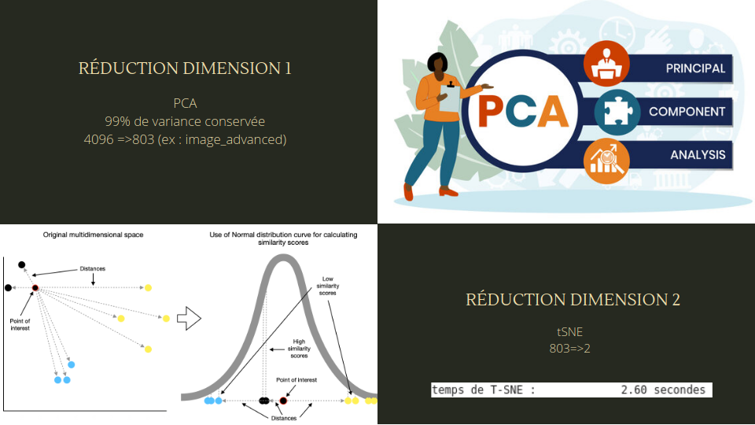

# Classification Automatique de Biens de Consommation

  

## Contexte

En tant que Data Scientist chez **Place de marché**, une entreprise qui lance une marketplace e-commerce anglophone, j'ai été chargé de développer un moteur de classification automatique des articles. Cette classification repose sur l'analyse des images et des descriptions textuelles des produits. Le projet vise à améliorer l'expérience utilisateur en automatisant l'attribution des catégories d'articles, une tâche qui est actuellement effectuée manuellement par les vendeurs.

## Objectif du Projet

Le projet se déroule en deux phases principales :
1. **Étude de Faisabilité** : Évaluer la faisabilité d'un moteur de classification d'articles en utilisant des méthodes de prétraitement et de feature engineering sur des données non structurées (texte et image).
2. **Classification Supervisée** : Mettre en œuvre une classification supervisée des images pour automatiser l'attribution des catégories de produits.

## Étapes de l'Analyse

1. **Prétraitement et Feature Engineering** :
    - Prétraitement des données textuelles : Nettoyage, tokenisation, lemmatisation, et création de features via bag-of-words, embeddings (Word2Vec, BERT, USE).
    - Prétraitement des données images : Traitement du contraste, extraction de features via SIFT/ORB/SURF et Transfer Learning avec CNN.

2. **Réduction de Dimension et Visualisation** :
    - Réduction en deux dimensions des features extraites pour projeter les produits sur un graphique 2D.
    - Analyse visuelle pour évaluer la faisabilité de la classification automatique des articles.

3. **Segmentation et Évaluation** :
    - Mesure de la similarité entre les catégories réelles et celles issues d'une segmentation en clusters pour confirmer l'analyse visuelle.

4. **Classification Supervisée** :
    - Implémentation d'une classification supervisée des images avec data augmentation pour optimiser le modèle.

5. **Collecte de Données via API** :
    - Utilisation d'une API pour collecter des données supplémentaires sur les produits (par exemple, produits à base de "champagne").

## Livrables

- **Notebook de Prétraitement et Feature Engineering** : Contient les fonctions permettant le prétraitement des données textes et images, ainsi que les résultats de l'étude de faisabilité.
- **Notebook de Classification Supervisée** : Décrit l'approche de classification supervisée des images.
- **Script de Collecte de Données** : Un script Python pour tester l'API et extraire les données des produits dans un fichier CSV.
- **Support de Présentation** : Présentation de l'ensemble du travail réalisé, incluant l'étude de faisabilité, la classification supervisée, et le test de l'API.

## Soutenance

La soutenance est basée sur le livrable de présentation et comprend les éléments suivants :
- Rappel de la problématique et présentation du jeu de données.
- Explication des prétraitements, des extractions de features, et des résultats de l'étude de faisabilité.
- Résultats de la classification supervisée.
- Présentation du test de l'API.

### Visionner la Soutenance

Vous pouvez visionner l'enregistrement de la soutenance à l'adresse suivante : [Lien vers la vidéo](https://youtu.be/cTKCwNcWcfc?si=ybJkYldGNupvtWZy).

## Contact

Pour plus d'informations sur moi ou pour accéder à mes coordonnées, veuillez visiter mon site web : [alexandre.rogues.fr](https://alexandre.rogues.fr).

Merci de l'intérêt que vous portez à ce projet !

